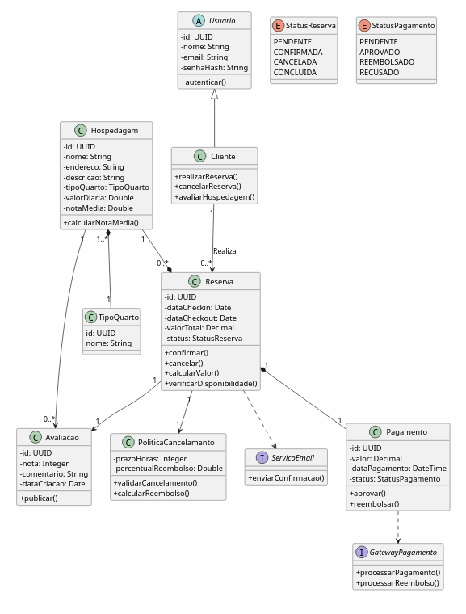

# Diagrama de Classes

## Objetivo

Neste diagrama, temos a modelagem das principais entidades que atuam nas seguintes fatias:

1. Reservar, pagar e confirmar;
2. Cancelar reserva com a política de reembolso;
3. Avaliar as instalações durante a estadia.

São feitas as classificações dos itens apenas que são pertinentes à modelagem desseas fatias, não fazendo parte elementos que não se relacionam com eles.

## Decisões de Modelagem

- A classe `Usuario` foi definida como abstrata para possibilitar especialização no futuro, como por exemplo "Administrador";
- A integração do pagamento e envio de emails foi realizada através de interfaces já que se trata de serviço externo;
- A relação de `Reserva` e `Pagamento` foi feita por meio de composição já que o pagamento não tem sentido sem a reserva associada;
- A relação de `Reserva` e `Avaliacao` foi feita por meio de composição já que a avaliação não tem sentido sem a reserva associada;
- As políticas de cancelamento foram modeladas em uma classe à parte.

## Diagrama (PlantUML)

## Principais Classes

### Cliente

Representa o usuário responsável por buscar hospedagens, realizar reservas, cancelar reservas e registrar avaliações.

### Hospedagem

Representa uma estadia na qual pode ter um tipo de quarto, e diversas reservas, além de informações gerais daquela hospedagem e suas avaliações.

### TipoQuarto

Representa uma categoria de acomodação disponível em uma hospedagem.

### Reserva

Entidade central do sistema. Controla o processo de reserva, seu ciclo de vida e sua associação com pagamento.

### Pagamento

Responsável por registrar transações financeiras associadas às reservas.

### PoliticaCancelamento

Encapsula as regras de negócio relacionadas a cancelamentos e reembolsos.

### Avaliacao

Representa a opinião de um cliente sobre uma hospedagem após a conclusão da estadia.

## Justificativa das Relações

| Relação                       | Tipo        | Justificativa                                                       |
| ----------------------------- | ----------- | ------------------------------------------------------------------- |
| TipoQuarto -> Hospedagem      | Associação  | Uma hospedagem possui um tipo de quarto                             |
| Reserva -> Pagamento          | Composição  | O pagamento está diretamente associado a uma reserva específica.    |
| Cliente -> Reserva            | Associação  | Um cliente pode realizar várias reservas ao longo do tempo.         |
| Hospedagem -> Avaliação       | Associação  | Uma hospedagem pode possuir diversas avaliações.                    |
| Reserva -> Avaliação          | Composição  | Uma avaliação só pode ser criada a partir de uma reserva concluída. |
| Pagamento -> GatewayPagamento | Dependência | O processamento financeiro depende de um serviço externo.           |
| Reserva -> ServicoEmail       | Dependência | O envio da confirmação ocorre através de um serviço externo.        |

