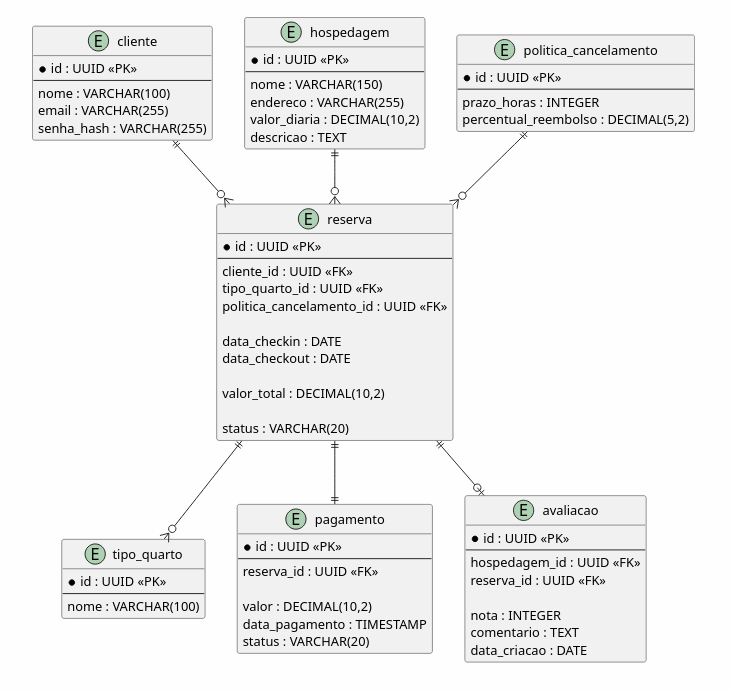

# Modelo Entidade-Relacionamento (MER)

## Objetivo

O MER foi elaborado a partir das classes persistentes identificadas no diagrama de classes das três fatias selecionadas:

Realização de reserva com pagamento e confirmação;
Cancelamento de reserva e reembolso;
Avaliação de hospedagens.

Foram modeladas apenas entidades cujos dados precisam ser armazenados permanentemente.

## Diagrama MER (PlantUML)

## Cardinalidades

| Relacionamento                  | Cardinalidade |
| ------------------------------- | ------------- |
| Cliente -> Reserva              | 1:N           |
| TipoQuarto -> Hospedagem        | 1:N           |
| TipoQuarto -> Reserva           | 1:N           |
| PolíticaCancelamento -> Reserva | 1:N           |
| Reserva -> Pagamento            | 1:1           |
| Cliente -> Avaliação            | 1:N           |
| Hospedagem -> Avaliação         | 1:N           |
| Reserva -> Avaliação            | 1:1           |

## Divergências esperadas

Abaixo, uma lista a respeito das divergências esperadas entre o diagrama MER e o diagrama de classes:

- **Serviços e Interfaces:** As classes de 
