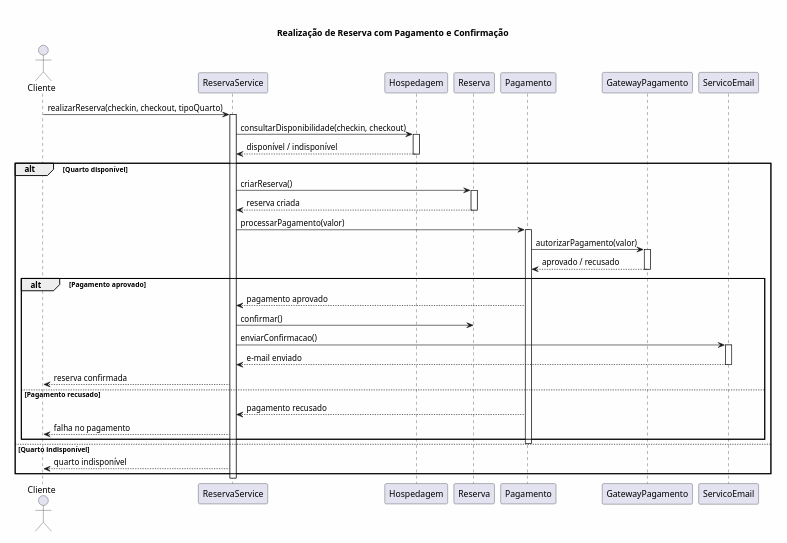

# Modelagem Comportamental — Fatia 1

# Realização de Reserva com Pagamento e Confirmação

## Justificativa da Escolha

Decidiu-se utilizar um **Diagrama de Sequência**, visto que esta fatia trata de uma interação de várias partes do sistema.

O fluxo de reserva é composto por diferentes responsabilidades: verificar disponibilidade, realizar a reserva, realizar o pagamento e notificar o cliente sobre a reserva. Existem ainda cenários alternativos como, por exemplo, quando não há quartos disponíveis ou quando ocorre um problema com o pagamento, que poderão ser abordados por fragmentos `alt` da UML.

# Diagrama de Sequência

# Descrição do Fluxo

1. O cliente faz um pedido de reservas indicando datas de check-in e check-out, bem como o tipo de quarto que deseja.
2. O sistema verifica a disponibilidade no período pedido pelo cliente.
3. Quando existe disponibilidade, é feita uma reserva com status inicial.
4. É feito o pagamento através do gateway.
5. Quando o pagamento é realizado com sucesso:
   - a reserva é efetuada;
   - é enviado um e-mail confirmando a reserva;
   - a confirmação de reserva é feita para o cliente.
6. Quando o pagamento é negado pelo banco:
   - a reserva não é efetuada;
   - o cliente é informado sobre a situação.
7. Quando não há disponibilidade no período desejado pelo cliente, é notificado imediatamente.

# Cenários Alternativos Modelados

## A1 — Quarto indisponível

Na checagem da disponibilidade, o sistema verifica que não há disponibilidade para o período desejado.

Conclusão:
- Não será realizada a reserva;
- O pagamento não será efetuado;
- O cliente receberá uma mensagem de indisponibilidade.

## A2 — Pagamento recusado

O gateway retorna uma resposta de rejeição da transação.

Resultado:
- Reserva permanece não confirmada;
- Nenhum e-mail de confirmação é enviado;
- Cliente recebe mensagem de erro de pagamento.
