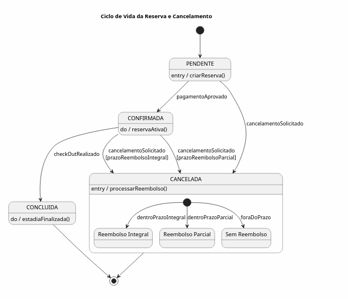

# Modelagem Comportamental — Fatia 2

# Cancelamento de Reserva e Aplicação de Política de Reembolso

## Justificativa da Escolha

Selecionou-se como forma de modelagem o **Diagrama de Estados** uma vez que essa fatia está voltada para o ciclo de vida da entidade `Reserva`.

Os critérios de cancelamento variam conforme o estado atual da Reserva e a política de cancelamento da Reserva. Diversas transições podem levar ao retorno total, parcial ou ainda não permitir o cancelamento da Reserva.

O diagrama de estados fornece a capacidade de visualizar os eventos que levam à mudança de estados, bem como suas respectivas regras de negócio.

# Diagrama de Estados

# Descrição dos Estados

## PENDENTE

Estado inicial da reserva após sua criação.

Neste estado:
- a reserva foi registrada;
- o pagamento ainda não foi confirmado;
- o cliente pode cancelar a solicitação sem restrições.

## CONFIRMADA

A reserva entra neste estado após a aprovação do pagamento.

Neste momento:
- a vaga é efetivamente bloqueada para o período reservado;
- a política de cancelamento passa a ser aplicada;
- o cliente pode solicitar cancelamento conforme as regras vigentes.

## CONCLUIDA

Representa uma estadia finalizada.

A reserva chega a este estado após a realização do check-out.

Reservas concluídas não podem mais ser canceladas.

## CANCELADA

Representa uma reserva cancelada.

Ao entrar neste estado, o sistema avalia a política de cancelamento para determinar o tipo de reembolso aplicável.

O cancelamento pode resultar em:
- reembolso integral;
- reembolso parcial;
- ausência de reembolso.

# Eventos

| Evento                 | Descrição                         |
| ---------------------- | --------------------------------- |
| pagamentoAprovado      | Pagamento confirmado pelo gateway |
| cancelamentoSolicitado | Cliente solicita cancelamento     |
| checkOutRealizado      | Estadia concluída                 |

# Guardas Utilizadas

| Guarda                 | Significado                                                                               |
| ---------------------- | ----------------------------------------------------------------------------------------- |
| prazoReembolsoIntegral | Cancelamento realizado dentro do prazo para restituição total                             |
| prazoReembolsoParcial  | Cancelamento realizado após o prazo integral, mas ainda elegível para restituição parcial |
| foraDoPrazo            | Cancelamento sem direito a reembolso                                                      |

# Regras de Negócio Representadas

## RN-01 — Cancelamento antes da confirmação

Reservas em estado `PENDENTE` podem ser canceladas imediatamente.

## RN-02 — Cancelamento após confirmação

Reservas em estado `CONFIRMADA` estão sujeitas à política de cancelamento configurada para a hospedagem.

Ao cancelar uma reserva confirmada, o sistema deve calcular automaticamente o valor de reembolso com base na política associada.

## RN-04 — Reserva concluída

Reservas em estado `CONCLUIDA` não podem retornar para estados anteriores e não podem ser canceladas.
