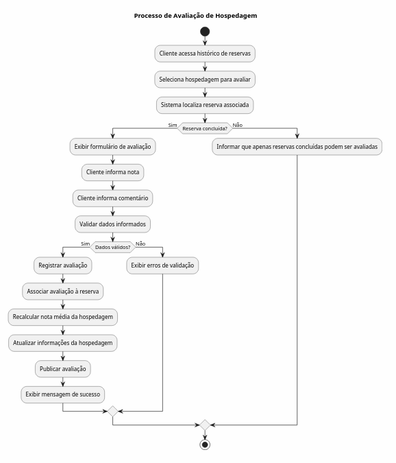

# Modelagem Comportamental — Fatia 3

# Avaliação de Hospedagens

## Justificativa da Escolha

Optou-se pelo uso de um **Diagrama de Atividades**, pois esta fatia representa um fluxo de trabalho composto por diversas etapas e decisões de negócio.

O processo envolve a validação da elegibilidade do cliente para realizar uma avaliação, o preenchimento da avaliação, o armazenamento dos dados e a atualização da nota média da hospedagem.

A utilização de atividades e nós de decisão permite representar claramente as regras de autorização e o fluxo completo até a publicação da avaliação.

# Diagrama de Atividades

# Descrição do Fluxo

1. O cliente acessa seu histórico de reservas.
2. Seleciona uma hospedagem para avaliar.
3. O sistema verifica se existe uma reserva concluída associada à hospedagem.
4. Caso a reserva esteja concluída:
   - o formulário de avaliação é disponibilizado;
   - o cliente informa nota e comentário;
   - os dados são validados.
5. Se os dados forem válidos:
   - a avaliação é registrada;
   - a avaliação é associada à reserva correspondente;
   - a nota média da hospedagem é recalculada;
   - a avaliação é publicada.
6. Caso a reserva não esteja concluída, o sistema impede a avaliação e informa o motivo ao usuário.

---

# Decisões Representadas

## D1 — Reserva concluída

O cliente somente pode avaliar uma hospedagem caso possua uma reserva finalizada associada a ela.

### Resultado positivo

Permite prosseguir para o formulário de avaliação.

### Resultado negativo

Impede a criação da avaliação.

## D2 — Dados válidos

Após o preenchimento do formulário, o sistema valida os dados informados.

Exemplos de validações:
- nota dentro do intervalo permitido (1 a 5);
- comentário dentro do limite de caracteres;
- campos obrigatórios preenchidos.

### Resultado positivo

Avaliação é registrada e publicada.

### Resultado negativo

O sistema solicita correção dos dados.

# Regras de Negócio Representadas

## RN-01 — Elegibilidade para avaliação

Somente clientes que concluíram uma reserva podem registrar avaliações para uma hospedagem.

## RN-02 — Associação à reserva

Toda avaliação deve estar vinculada a uma reserva existente e concluída.

## RN-03 — Atualização da nota média

Após o registro de uma nova avaliação, a nota média da hospedagem deve ser recalculada automaticamente.

## RN-04 — Validação dos dados

O sistema não deve permitir o registro de avaliações com dados inválidos ou incompletos.

# Atores Envolvidos

| Ator    | Responsabilidade                                                |
| ------- | --------------------------------------------------------------- |
| Cliente | Solicitar e preencher a avaliação                               |
| Sistema | Validar elegibilidade, registrar avaliação e atualizar métricas |

